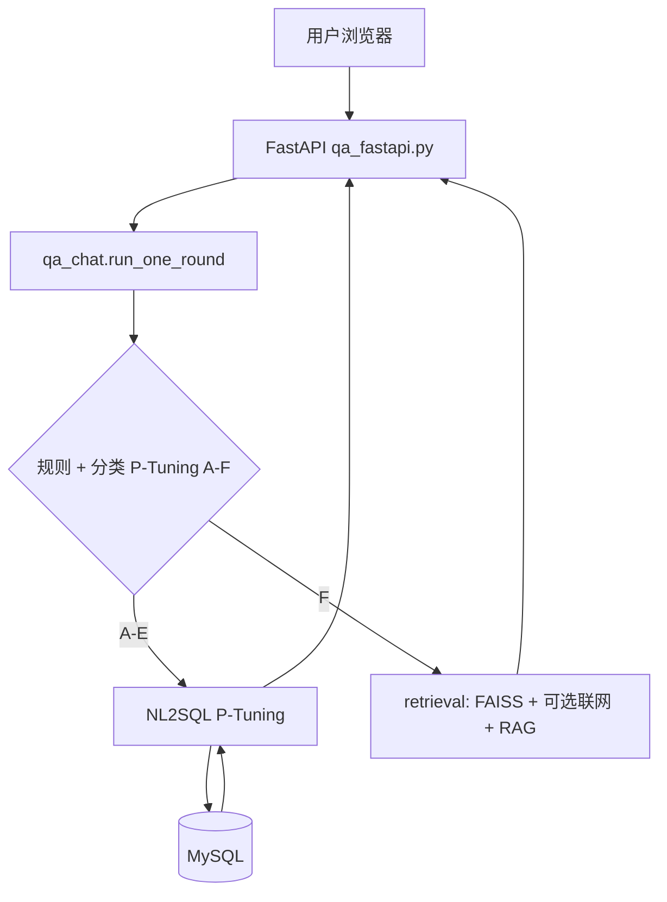

# 政府采购投标助手 — 技术原理与可行性评估报告（详版）

| 项目 | 说明 |
|------|------|
| **评估基准日期** | 2026 年 3 月 |
| **代码根目录** | `Code/`（环境变量 `CODE_BASE_DIR` 可覆盖默认的 `config/` 上一级路径） |

---

## 一、系统整体架构

本系统是一个面向**政府采购 / 招投标**领域的垂直对话问答平台，将 **P-Tuning v2 参数高效微调**、**NL2SQL 自然语言转 SQL**、**RAG 检索增强生成** 组合为一条可落地的端到端链路：从自然语言问题路由到 **库表查询结果** 或 **政策法规类解析**，并在 Web 端展示文本答案、可选 **ECharts** 图表与引用链接。

### 1.1 分层说明

| 层级 | 实现要点 |
|------|----------|
| **用户层** | 浏览器 **HTML / CSS / JS**；图表 **ECharts**（NL2SQL 分支在具备图表意图时返回 `chart` JSON） |
| **接口层** | **FastAPI**（`qa_fastapi.py`），默认端口 **7860**；`asyncio.Lock` 对单进程内推理做串行保护 |
| **推理编排** | **`qa_chat.run_one_round()`**：完整模式下串联分类 → SQL 或 RAG |
| **模型层** | **ChatGLM2-6B** 基座 + **三套独立 P-Tuning**（分类 / NL2SQL / 关键词），由 `chatglm_ptuning.build_qa_models()` 加载 |
| **路由层** | 意图 **A–F**：**A–E** 走 NL2SQL + 执行；**F** 走向量检索 + 生成 |
| **执行层** | NL2SQL → **MySQL**（或配置下的 SQLite）执行 + **SQL 多级纠错**；F 类：**FAISS** +（可选）**DeepSeek 补充** + **LangChain LCEL / stuff 链** |
| **数据层** | 业务库 **MySQL**（采购结果宽表等）；政策法规 **FAISS** 索引目录由 `POLICY_VECTOR_INDEX_DIR` 等解析 |

### 1.2 端到端交互流程（文字）

1. 用户通过浏览器向 **`POST /api/chat`** 提交自然语言问题（可选 `agent_mode`、`conversation_id` 等）。
2. **意图判定**：先经**规则先验**（正则等）；未覆盖则调用**分类 P-Tuning**，输出 **A–F**。
3. **A–E（SQL 类）**：**NL2SQL P-Tuning** 生成 SQL → 连接 **MySQL** 执行 → 结果经底座模型整理为自然语言；若识别出可视化意图，可返回 **ECharts option**。
4. **F（开放 / 政策类）**：**政策法规 FAISS** 检索 +（可选）**联网与外部补充** → **text2vec / jieba** 重排 → **LCEL 优先**，降级 **LangChain stuff**，再降级 **裸 Prompt + `model()`**。
5. 响应 **`ChatResponse`**：`answer`、`strategy`、`route`、原始分类片段、规范化类别、`chart`、`references` 等。

### 1.3 架构示意图



---

## 二、核心技术原理

### 2.1 P-Tuning v2 微调

**P-Tuning v2** 不修改基座 Transformer 主体权重，而在各层 Attention 前注入可训练的 **`prefix_encoder`（虚拟前缀）**，用较少参数编码任务先验。相对全量微调，参数量与显存压力显著降低，同时保留 ChatGLM 通用能力。

本项目在**同一 ChatGLM2-6B 基座**上挂载**多套独立前缀**（路径与 `pre_seq_len` 以 `config/cfg.py` 及实际 `checkpoint` 为准，可用环境变量覆盖）：

| 任务 | 典型 pre_seq_len | 量级说明 | 训练数据形态 |
|------|------------------|----------|----------------|
| 意图分类（A–F） | 512（以 cfg 为准） | 前缀权重约数十 MB 级 | 模板化问答类别数据（`ptuning/CLASSIFY_PTUNING`） |
| NL2SQL | 128 | 同上量级 | 问答-SQL 对（`ptuning/NL2SQL_PTUNING`） |
| 关键词 | 256 | 同上量级 | 模板数据（`ptuning/KEYWORDS_PTUNING`） |

训练与评测脚本位于各 `ptuning/*_PTUNING/` 目录；评测指标需结合任务解读（例如分类标签为单字母时 **ROUGE-2 无信息量**，应看 **exact_match** 等）。

### 2.2 NL2SQL

将用户问题与**表结构 / 字段说明**拼入统一 Prompt，由 **NL2SQL P-Tuning** 输出 SQL。当前工程面向**固定业务表**（如 `shggzy_bid_result`，见 `MYSQL_SQL_TABLE` 等配置），单表宽表场景下模式相对可控。

**鲁棒性设计（概念层）**：

1. **数字 / 文本一致性**：对问题与 SQL 中实体做比对与修正（见 `sql_correct_util.py` 等）。
2. **字段与同义词**：字段无法解析时从候选中替换。
3. **执行失败反馈**：MySQL 报错信息回灌，由模型或规则尝试重写 SQL（具体逻辑见 `answers/sql_answer.py` 分支）。

### 2.3 RAG（F 类）

F 类走 **`answers/retrieval.py`**：**离线 FAISS 政策索引** +（可选）**DeepSeek 补充材料**（`cfg` 中 `F_USE_DEEPSEEK_SUPPLEMENT` 等）；证据经 **text2vec 语义重排**，失败则 **jieba 词法 Jaccard** 重排；生成侧 **LCEL（`rag_lcel.py`）→ LangChain stuff（`langchain_rag.py`）→ 直接 Prompt** 三级降级。

### 2.4 意图路由

**规则先验 + 模型分类** 双通道：高频、模式稳定的问题可走规则以省延迟；否则由 **分类 P-Tuning** 输出类别，再经 **归一化** 映射到 A–F，与 `answers/constants.py` 中 **SQL 触发类 / 开放类** 对齐。

---

## 三、Linux 完整模式启动方案（`start_procurement_fastapi.sh`）

当前仓库推荐的 **Linux 一键启动** 由项目根目录下 **`start_procurement_fastapi.sh`** 定义，与 `qa_fastapi.py` 配合使用。脚本特点：**进入 `Code` 目录**、设置**默认环境变量**、用 **`exec`** 前台启动服务（便于 `Ctrl+C` 结束）。

### 3.1 脚本行为摘要

| 项目 | 内容 |
|------|------|
| **工作目录** | 自动 `cd` 到脚本所在目录（即 `Code/`，与 `qa_fastapi.py` 同级） |
| **解释器** | `${PYTHON:-python3}`，可通过 **`export PYTHON=...`** 指定虚拟环境 Python |
| **监听地址** | `qa_fastapi.py --gpu 0 --host 0.0.0.0 --port 7860`（局域网/云安全组需放行 **7860**） |
| **稳定性** | `set -euo pipefail`；`PYTHONUNBUFFERED=1` 便于日志实时输出 |
| **CUDA 显存** | `PYTORCH_CUDA_ALLOC_CONF` 默认 `expandable_segments:True`，减轻碎片化 |

### 3.2 脚本内建默认环境变量（可在启动前 `export` 覆盖）

以下为 **`start_procurement_fastapi.sh` 当前默认值**，代表「**完整 ChatGLM + 三套 P-Tuning**」场景下的**现行推荐基线**（偏省显存：默认开启 **8bit 量化**）：

| 变量 | 默认值 | 含义 |
|------|--------|------|
| `QA_CLASSIFY_DEVICE` | **`cuda`** | 分类 P-Tuning 所在设备；**显存不足**可改为 `cpu`，把分类放内存以换显存 |
| `CHATGLM_LOAD_IN_8BIT` | **`1`** | 基座等走 **bitsandbytes 8bit**（需已安装 `bitsandbytes` 且 CUDA 可用），降低显存占用 |
| `QA_MODEL_DEVICE_SPLIT` | **`0`** | 与 `qa_chatglm_device_split()` / `build_qa_models()` 中的多模型设备分配配合；`1` 时分类槽位明确受 `QA_CLASSIFY_DEVICE` 约束（详见 `config/cfg.py` 内注释） |
| `QA_CHATGLM_DEVICE` | **`cuda`** | 底座 ChatGLM 推理设备 |
| `QA_CHATGLM_FP16` | **`1`** | FP16 主干（与 P-Tuning 常见组合一致） |
| `LLM_MODEL_DIR` | **`$Code/data/pretrained_models/chatglm2-6b`** | ChatGLM2-6B 基座目录；**启动前可 `export LLM_MODEL_DIR=/其它路径`** |

脚本会在终端打印 **`LLM_MODEL_DIR`** 与端口说明；若加载分片报错，提示安装 **`accelerate`**。

### 3.3 启动命令

```bash
cd /path/to/Code
chmod +x start_procurement_fastapi.sh
./start_procurement_fastapi.sh
```

等价进程参数为：

```text
python3 qa_fastapi.py --gpu 0 --host 0.0.0.0 --port 7860
```

（若使用 `PYTHON` 环境变量，则替换为对应解释器。）

### 3.4 与其它启动方式的关系

- **`deploy/linux/run_qa_fastapi.sh`**：可从任意位置调用，若存在 **`deploy/linux/env.local`** 会先 `source`，适合服务器上集中写 **`MYSQL_*`、`LLM_MODEL_DIR`** 等；再 **`exec python3 qa_fastapi.py --gpu ...`**。
- **Windows**：对应 **`start_procurement_fastapi.bat`**，语义与 Linux 脚本一致（路径分隔符不同）。

### 3.5 业务与可选能力相关环境变量（脚本未写死，运行时自行注入）

| 变量 | 含义 |
|------|------|
| `MYSQL_HOST` / `MYSQL_USER` / `MYSQL_PASSWORD` / `MYSQL_DATABASE` | 业务库连接（**生产环境须用环境变量或 `env.local`，勿提交仓库**） |
| `POLICY_VECTOR_INDEX_DIR` | 政策法规 FAISS 目录；**未设置时** `config/cfg.py` 会探测 `Code/vector_index_policy`（与同目录下 `policy.faiss` 配套） |
| `DEEPSEEK_API_KEY` | F 类补充材料（按需） |

### 3.6 模型加载与显存（与现行默认的关系）

完整模式会加载 **分类 + NL2SQL + 底座** 相关模块。当前脚本通过 **`CHATGLM_LOAD_IN_8BIT=1`** 与 **`QA_CHATGLM_FP16=1`** 在多数环境下控制占用；若仍 **OOM**，可按脚本注释将 **`QA_CLASSIFY_DEVICE=cpu`**，或启用 `deploy/linux` 文档中的精简/探针模式（见下节）。具体设备分配以 **`chatglm_ptuning.build_qa_models()`** 与 **`config/cfg.py`** 为准。

### 3.7 并发与健康检查

单进程内 **`asyncio.Lock`** 串行化推理；**`GET /api/health`** 返回 `models_loaded`、`sql_cursor_ok`、`smoke`、精简/探针标记等。

---

## 四、运行模式变体（精简 / RAG 探针）

在 **`start_procurement_fastapi.sh` 默认完整模式**之外，可通过**其它启动脚本或环境变量**切换形态：

| 对比维度 | 完整模式（默认 sh） | 精简模式 | RAG 探针 |
|----------|---------------------|----------|----------|
| **典型启动** | `start_procurement_fastapi.sh` | `start_procurement_fastapi_lite.sh` | `start_procurement_fastapi_rag_probe.sh` |
| **关键变量** | 见 §3.2 默认 | `QA_LITE_NL2SQL_ONLY=1` 等 | **`QA_RAG_PROBE=1`** |
| **加载模型** | 分类 + NL2SQL + 底座 | 常仅 NL2SQL ± 底座 | **仅底座** |
| **MySQL** | 需要（SQL 分支） | 需要 | **不连接** |
| **适合验证** | 端到端演示 | SQL 查询能力 | **F 类 RAG 链路** |
| **显存** | 依赖 8bit/设备策略 | 中 | **相对较低** |

**选择建议**：调试 **RAG** 用探针；只测 **NL2SQL** 用精简；全链路演示用 **`start_procurement_fastapi.sh`** 的完整模式（并配置好 `MYSQL_*` 与模型路径）。

---

## 五、RAG 子系统深度说明

### 5.1 RAG 探针模式（`QA_RAG_PROBE=1`）

- **`qa_chat.run_one_round`** 在检测到 `QA_RAG_PROBE` 后，**跳过分类与 SQL**，直接 **`retrieval.answer_via_retrieval(q, chat_model)`**。
- 仅加载 **底座 ChatGLM**（无分类/NL2SQL 前缀），**不连 MySQL**。
- 输出为 **纯文本策略**，**无 ECharts**（`chart=None`）。

### 5.2 `answer_via_retrieval` 逻辑顺序（概念）

1. **`_get_policy_rag_evidence_blocks`**：从 `POLICY_VECTOR_INDEX_DIR` 下 **FAISS** 检索 Top-K 政策片段。
2. **`get_ranked_evidence_chunks`**：合并 DeepSeek 等外部片段（若启用且密钥有效）。
3. **`_rank_chunks`**：**text2vec 语义** 优先，否则 **jieba 词法**。
4. 生成：**LCEL**（`USE_LANGCHAIN_LCEL_RAG`）→ **stuff 链**（`USE_LANGCHAIN_RAG`）→ **`build_rag_prompt` + `model()`**。

### 5.3 关键依赖与风险

| 条件 | 影响 |
|------|------|
| `policy.faiss` 缺失或路径错误 | 本地政策检索弱或为空，质量依赖联网与模型先验 |
| `TEXT2VEC_MODEL_DIR` 未就绪 | 语义重排退化到 jieba |
| DeepSeek 未配置 | 补充链路跳过（仅政策 FAISS 等） |
| LangChain 新旧栈并存 | `rag_lcel.py` 与 `langchain_rag.py` 需版本与依赖一致 |

### 5.4 RAG 探针的定位

适合作为 **开发联调工具** 与 **F 类质量评估**，**不可替代**完整系统（不覆盖 A–E SQL）。

---

## 六、数据与配置安全

- **MySQL**：业务数据与（可选）用户会话库；跨云部署时在 RDS **白名单**放行推理机出口 IP，使用**最小权限账号**。
- **密钥**：生产环境通过 **环境变量** 或 **`deploy/linux/env.local`**（不提交仓库）注入；禁止将真实口令、API Key 写入版本库。
- **索引**：政策法规 FAISS 需版本化与定期重建。

---

## 七、风险与问题清单

| 风险项 | 严重程度 | 说明与处置方向 |
|--------|----------|----------------|
| **显存 OOM** | 高 | 即便默认 8bit，三套件仍可能吃满；`QA_CLASSIFY_DEVICE=cpu`、`QA_MODEL_DEVICE_SPLIT` 与 `cfg` 组合、精简/探针模式或更大显存 |
| **凭据泄露** | 高 | 仅环境注入；轮换已暴露的口令 |
| **训练数据与模板** | 中 | 长尾泛化需持续标注 |
| **单锁串行** | 中 | 多进程或独立推理服务 |
| **transformers / ChatGLM 兼容性** | 中 | 升级依赖需回归 |
| **索引缺失** | 中 | F 类质量波动 |

---

## 八、可行性综合评估

| 维度 | 结论 | 说明 |
|------|------|------|
| 架构路线 | **可行** | 「分类 + NL2SQL + RAG」组合成熟 |
| P-Tuning 工程化 | **可行** | 训练与评测脚本齐备 |
| NL2SQL | **基本可行** | 单表 + 纠错链；复杂 SQL 需迭代 |
| RAG | **可行** | 三级降级 + 双路重排 |
| 前端与部署 | **可行** | `start_procurement_fastapi.sh` + `deploy/linux` / Docker |
| **生产上线** | **需加固** | 安全、并发、监控 |

---

## 九、改进建议（优先级排序）

1. **安全**：密钥与数据库密码仅环境注入；公网 RDS 限 IP。
2. **显存**：按机器实测调整 `QA_CLASSIFY_DEVICE`、`CHATGLM_LOAD_IN_8BIT` 与 `cfg` 中设备策略并文档化。
3. **数据**：真实标注增量；政策索引更新机制。
4. **并发**：多 worker 或队列。
5. **可观测性**：日志与命中率、SQL 成功率。

---

## 十、总体结论

本仓库实现了一套**层次清楚**的政府采购场景对话系统：**P-Tuning**、**NL2SQL + MySQL**、**FAISS + LangChain + 可选联网** 的 RAG 链路相互衔接。**Linux 下推荐以 `start_procurement_fastapi.sh` 为入口**：默认 **8bit + FP16 + 全链路 GPU 基线**，可按显存与业务在环境变量中覆盖。**生产上线**仍须在安全、并发与监控上按第九章落地。

---

## 附录：关键源码索引

| 模块 | 路径 |
|------|------|
| Linux 完整模式启动 | `start_procurement_fastapi.sh` |
| FastAPI 入口 | `qa_fastapi.py` |
| 单轮编排 | `qa_chat.py` |
| 模型构建 | `chatglm_ptuning.py` |
| 全局配置 | `config/cfg.py` |
| SQL 分支 | `answers/sql_answer.py` |
| RAG 主逻辑 | `answers/retrieval.py` |
| LCEL RAG | `answers/rag_lcel.py` |
| LangChain stuff | `answers/langchain_rag.py` |
| DeepSeek 补充 | `answers/deepseek_supplement.py` |
| 用户与会话 API | `user_backend/` |
| 部署说明 | `deploy/linux/README.md`、`deploy/docker/README.md` |

---

*文档结束。*
